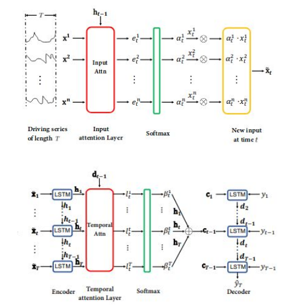
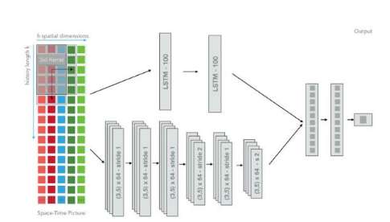
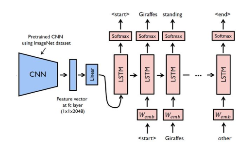

This is repository for course final project under CS231n: Convolutional Neural Networks for Visual Recognition by Stanford University. 

# Predicting Stock Index Returns Using Recurrent and Convolutional Neural Networks

This paper is a continuation of the study done by Qin et al[2] in capturing correlated features from the component stocks of the NASDAQ 100 via a convolutional neural network (CNN) in an effort to predict the future price of the NASDAQ 100.  The baseline model is a Dual-Stage Attention-Based RNN (DA-RNN)[2] which is tested against a LSTM[1], CNN[1], and an Encoder Decoder CNN-LSTM similar to Image Captioning[4]. 

The dataset is the original small dataset used in the DA-RNN papers[2] and includes 105 days worth of 1-minute OHLC bars of stock data from July 26, 2016 to December 22, 2016.  Each day contains 390 data points except for November 25 (210 datapoints) and December 22 (180 data points).  The annual index rebalance announcement was released on December 9, 2016 and four out of the 81 companies were dropped from the price index.  There is a visibile price jump towards the end of the test set reflecting this change.

#### Download dataset

## Installation
##### Clone and install requirements
    $ git clone https://github.com/tesaho/index_prediction
    $ cd index_prediction/
    $ sudo pip3 install -r requirements.txt

### Running test code

## Credits
#### Authors

1) Grob W., Lange S., Bodecker J., Blum M., "Predicting Time Series with Space-Time Convolutional and Recurrent Neural NetworksContributing".  ESANN 2017 proceedings, European Symposium on Artificial Neural Networks, Computational Intelligence and Machine Learning. Bruges (Belgium), 26-28 April 2017. 

2) Qin Y., Song D., Cheng H., Cheng W., Jiang G., Cottrell G., "A Dual-Stage Attention Based Recurrent Neural Network for Time Series Prediction".  International Joint Conference on Artificial Intelligence (IJCAI), 2017.

3) Zuo, Chandler.  ["A PyTorch Example to use RNN for Financial Prediction"](https://github.com/chandlerzuo/chandlerzuo.github.io/tree/master/codes/da_rnn)

4) Choi, Yunjey.  ["PyTorch Tutorial 03-advanced. Image Captioning"](https://github.com/yunjey/pytorch-tutorial/blob/master/tutorials/03-advanced/image_captioning/model.py)

## License

This project is licensed under the MIT License - see the [LICENSE.md](LICENSE.md) file for details.

